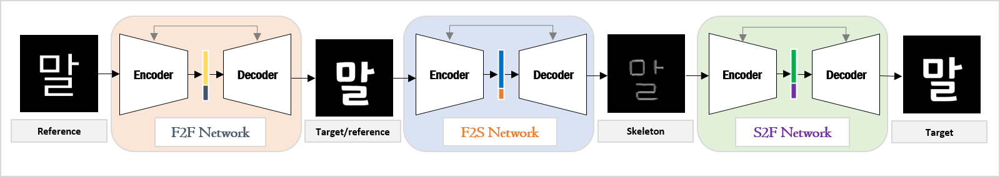
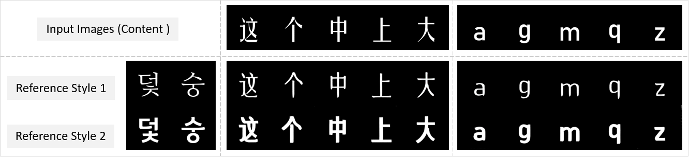

# SKFont

## Introduction

This is the Tensorflow implementation of the **SKFont: Skeleton-Driven Korean Font Synthesis with Conditional Deep Adversarial Networks**.

[paper will be available soon](https://github.com/ammar-deep)

## Abstract
Will be added soon

## Model Architecture


## Some Results

### SKFont results on Gothic and Ming font styles


### SKFont results on unseen cross languages


### SKFont results on cursive font styles


## Prerequisites

- Windows
- CPU or NVIDIA GPU + CUDA cuDNN
- python 3.6.8
- tensorflow-gpu 1.13.1
- pillow 6.1.0 

## Get Started

### Installation

#### Setting up the environment
1. ```
   conda create --name tutorial-TF python=3.6.8
   ```
2. ```
   conda activate tutorial-TF or activate tutorial-TF
   ```
3. ```
   conda install -c anaconda tensorflow-gpu=1.13.1
   ```
4. ```
   conda env update --file tools.yml
   ```

### Datasets
Our model consists of three sub models namely F2F-F2S-S2F. For each model we have to prepare a paired dataset. i.e. a source to target font paired dataset, a target font to corresponing skeleton dataset, and a target skeleton to corresponding font dataset. 
To do this place any korean font in scr_font directory and N number of target fonts in the trg_font directory. Then run the below commands for data preprocessing.

1. Generate Source font images
    ```
    python ./tools/src-font-image-generator.py
    ```
    
2. Generate Target font images
    ```
    python ./tools/trg-font-image-generator.py
    ```
    
3. Generate Target font skeleton images
    ```
    python ./tools/trg-skeleton-image-generator.py
    ```
    
4. Combine source, target, and target skeletons
    ```
    python ./tools/combine_images.py --input_dir src-image-data/images --b_dir trg-image-data/images --c_dir skel-image-data/images --operation combine
    ```
    
5. Convert images to TFRecords
    ```
    python ./tools/images-to-tfrecords.py
    ```
